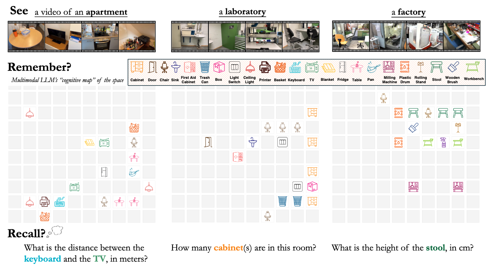
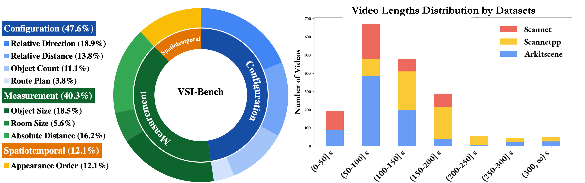
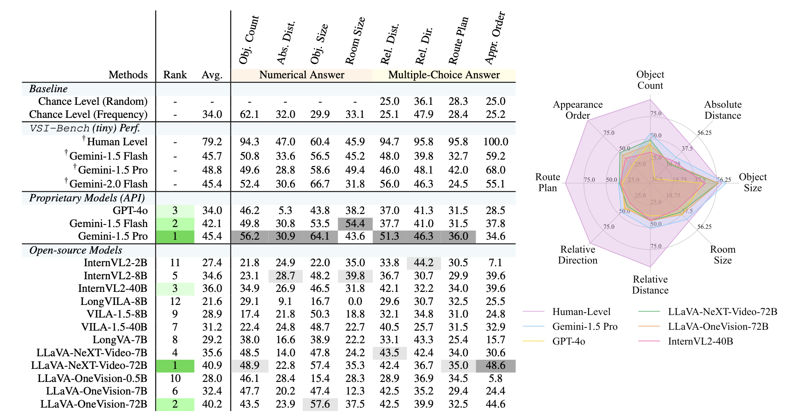

<div align="center" style="font-family: charter;">

<h1><i>Thinking in Space</i>:</br> How Multimodal Large Language Models See, Remember and Recall Spaces</h1>


<br />

<a href="https://arxiv.org/abs/2412.14171" target="_blank">
    
</a>
<a href="https://vision-x-nyu.github.io/thinking-in-space.github.io/" target="_blank">
    
</a>
<a href="https://huggingface.co/datasets/nyu-visionx/VSI-Bench" target="_blank">
    
</a>

<div>
    <a href="https://jihanyang.github.io/" target="_blank">Jihan Yang</a><sup>1*</sup>,</span>
    <a href="https://github.com/vealocia" target="_blank">Shusheng Yang</a><sup>1*</sup>, </span>
    <a href="https://anjaliwgupta.com/" target="_blank">Anjali W. Gupta</a><sup>1*</sup>,</span>
    <a href="https://rilynhan.github.io" target="_blank">Rilyn Han</a><sup>2*</sup>,</span>
    <a href="https://profiles.stanford.edu/fei-fei-li" target="_blank">Li Fei-Fei</a><sup>3</sup>,</span>
    <a href="https://www.sainingxie.com/" target="_blank">Saining Xie</a><sup>1</sup>,</span>
</div>

<div>
    <sup>1</sup>New York University&emsp;
    <sup>2</sup>Yale University&emsp;
    <sup>3</sup>Stanford University&emsp;
</div>


<p align="justify"><i>Whether at home, in the workplace, or elsewhere, the ability to perceive a space, remember its layout, and retrieve this spatial information to answer questions on demand is a key aspect of visual-spatial intelligence. Recent Multimodal LLMs can understand general videos, but can they "think spatially" when presented with a video recording of an environment? Can they build an accurate, implicit "cognitive map" that allows them to answer questions about a space? What are the strengths and limitations of using MLLMs to enhance spatial intelligence? We dig into these questions by setting up video data for MLLMs to watch, building a VQA benchmark to check their recall, and examining what the MLLMs actually remember and understand.</i></p>

</div>

## Release
- `2025-02-27` :hearts: Our paper `Thinking-in-Space` is accepted by CVPR 2025! See u in Nashville!
- `2024-12-19` :rocket: We released our VSI-Bench and corresponding evaluation code.

## Contents

- [Release](#release)
- [Contents](#contents)
- [VSI-Bench](#vsi-bench)
- [Results](#results)
- [RUN Your Own Evaluation](#run-your-own-evaluation)
  - [Benchmark](#benchmark)
  - [Installation](#installation)
  - [Evaluation](#evaluation)
- [Acknowledgement](#acknowledgement)
- [Citation](#citation)

## VSI-Bench

**Overview:** We introduce VSI-Bench, a benchmark designed to evaluate the visual-spatial intelligence of Multimodal LLMs (MLLMs). VSI-Bench comprises over 5,000 question-answer pairs derived from 288 egocentric videos sourced from the validation sets of public indoor 3D scene reconstruction datasets ScanNet, ScanNet++, and ARKitScenes.


**VSI-Bench** includes eight tasks categorized into three types: configurational, measurement estimation, and spatiotemporal. Iteratively refined for quality, VSI-Bench provides a foundational resource for studying the connection between MLLMs and 3D reconstruction.



## Results

**Evaluation Setups:** We benchmarked 15 video-supporting MLLMs from diverse model families. For proprietary models, we include Gemini-1.5 and GPT-4o. For open-source models, we evaluate models from InternVL2, ViLA, LongViLA, LongVA, LLaVA-OneVision, and LLaVA-NeXT-Video. All evaluations are conducted in zero-shot settings with default prompts and greedy decoding for reproducibility. Tasks are evaluated using either accuracy for Multiple-Choice Answer (MCA) tasks or our proposed Mean Relative Accuracy (MRA) for Numerical Answer (NA) tasks.



## RUN Your Own Evaluation

### Benchmark

Our benchmark is hosted on [HuggingFace](https://huggingface.co/datasets/nyu-visionx/VSI-Bench). You can simply access the benchmark data using the following code.
```python
# NOTE: pip install datasets

from datasets import load_dataset
vsi_bench = load_dataset("nyu-visionx/VSI-Bench")
print(dataset)
```

### Installation

```bash
conda create --name vsibench python=3.10
conda activate vsibench

git clone git@github.com:vision-x-nyu/thinking-in-space.git
cd thinking-in-space

git submodule update --init --recursive

cd transformers && pip install -e . && cd ..

pip install -e .
pip install s2wrapper@git+https://github.com/bfshi/scaling_on_scales
pip install deepspeed
```

### Evaluation

We provide a all-in-one evaluation scripts. You can simply run the following code to start your evaluation.

```bash
bash evaluate_all_in_one.sh --model all --num_processes 8 --benchmark vsibench
```

> Note: The evaluation results for open-source models may differ slightly from our tables due to additional data refinement. We will update the tables and our paper soon.

## Limitations

We strive to maintain the highest quality in our benchmark, but some imperfections may persist. If you notice any, we encourage you to reach out and share your valuable feedback!

## Acknowledgement

Our evaluation code is build upon [lmms-eval](https://github.com/EvolvingLMMs-Lab/lmms-eval). We acknowledge their team for providing this excellent toolkit for evaluating multimodal large language models.

## Citation

If you find our paper and code useful in your research, please consider giving us a star :star: and citing our work :pencil: :)
```
@article{yang2024think,
    title={{Thinking in Space: How Multimodal Large Language Models See, Remember and Recall Spaces}},
    author={Yang, Jihan and Yang, Shusheng and Gupta, Anjali and Han, Rilyn and Fei-Fei, Li and Xie, Saining},
    year={2024},
    journal={arXiv preprint arXiv:2412.14171},
}
```

